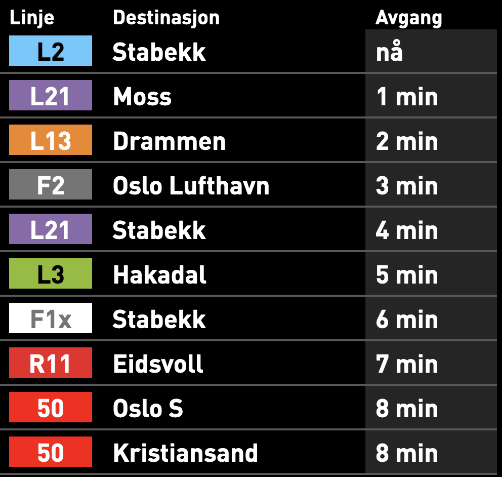

About
=====

Avgangstider gir deg avgangstider og potensielle forsinkelser for all
kollektivtrafikk som `Entur <https://en-tur.no/>`_ har oversikt over.
Pakka består av to deler:

*  Et Python-API for å hente avgangstider og forsinkelser fra Entur.
*  En Flask app som viser de neste avgangene fra et stoppested.

Screenshots
===========

This is what you would see in your browser for Oslo S:

...or for Jernbanetorget:

Run from Docker container
=========================

Avgangstider comes with a Docker container ready to run. In order to run your
own server, just do::

   docker run -d -p 5000:5000 marhoy/avgangstider

You can then access your own server at http://localhost:5000/

Installing
==========
Avgangstider requires Python 3.7. I recommend using `pyenv <https://github
.com/pyenv/pyenv>`_ for installing and managing and can be
installed
from
PyPi::

   pip install avgangstider

